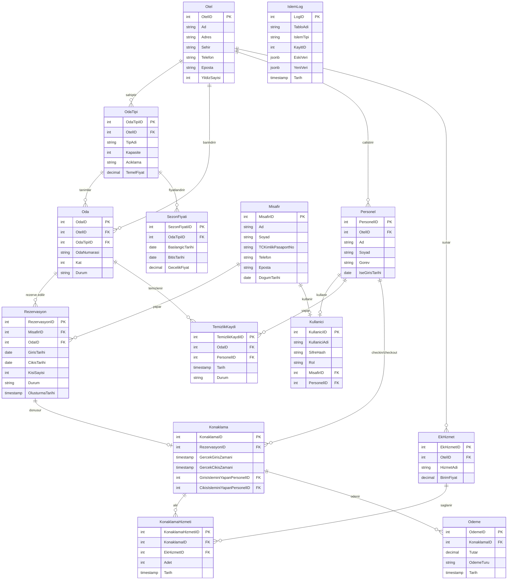

# Otel Rezervasyon Sistemi ER Diyagramı

```mermaid
erDiagram
    Otel {
        int OtelID PK
        string Ad
        string Adres
        string Sehir
        string Telefon
        string Eposta
        int YildizSayisi
    }
    
    OdaTipi {
        int OdaTipiID PK
        int OtelID FK
        string TipAdi
        int Kapasite
        string Aciklama
        decimal TemelFiyat
    }
    
    Oda {
        int OdaID PK
        int OtelID FK
        int OdaTipiID FK
        string OdaNumarasi
        int Kat
        string Durum
    }
    
    SezonFiyati {
        int SezonFiyatiID PK
        int OdaTipiID FK
        date BaslangicTarihi
        date BitisTarihi
        decimal GecelikFiyat
    }
    
    Misafir {
        int MisafirID PK
        string Ad
        string Soyad
        string TCKimlikPasaportNo
        string Telefon
        string Eposta
        date DogumTarihi
    }
    
    Personel {
        int PersonelID PK
        int OtelID FK
        string Ad
        string Soyad
        string Gorev
        date IseGirisTarihi
    }
    
    Kullanici {
        int KullaniciID PK
        string KullaniciAdi
        string SifreHash
        string Rol
        int MisafirID FK
        int PersonelID FK
    }
    
    Rezervasyon {
        int RezervasyonID PK
        int MisafirID FK
        int OdaID FK
        date GirisTarihi
        date CikisTarihi
        int KisiSayisi
        string Durum
        timestamp OlusturmaTarihi
    }
    
    Konaklama {
        int KonaklamaID PK
        int RezervasyonID FK
        timestamp GercekGirisZamani
        timestamp GercekCikisZamani
        int GirisIsleminiYapanPersonelID FK
        int CikisIsleminiYapanPersonelID FK
    }
    
    EkHizmet {
        int EkHizmetID PK
        int OtelID FK
        string HizmetAdi
        decimal BirimFiyat
    }
    
    KonaklamaHizmeti {
        int KonaklamaHizmetiID PK
        int KonaklamaID FK
        int EkHizmetID FK
        int Adet
        timestamp Tarih
    }
    
    Odeme {
        int OdemeID PK
        int KonaklamaID FK
        decimal Tutar
        string OdemeTuru
        timestamp Tarih
    }
    
    TemizlikKaydi {
        int TemizlikKaydiID PK
        int OdaID FK
        int PersonelID FK
        timestamp Tarih
        string Durum
    }
    
    IslemLog {
        int LogID PK
        string TabloAdi
        string IslemTipi
        int KayitID
        jsonb EskiVeri
        jsonb YeniVeri
        timestamp Tarih
    }

    Otel ||--o{ OdaTipi : "sahiptir"
    Otel ||--o{ Oda : "barindirir"
    Otel ||--o{ Personel : "calistirir"
    Otel ||--o{ EkHizmet : "sunar"
    
    OdaTipi ||--o{ Oda : "tanimlar"
    OdaTipi ||--o{ SezonFiyati : "fiyatlandirir"
    
    Misafir ||--o{ Rezervasyon : "yapar"
    Misafir ||--o| Kullanici : "kullanir"
    
    Personel ||--o| Kullanici : "kullanir"
    Personel ||--o{ TemizlikKaydi : "yapar"
    Personel ||--o{ Konaklama : "checkin/checkout"
    
    Oda ||--o{ Rezervasyon : "rezerve edilir"
    Oda ||--o{ TemizlikKaydi : "temizlenir"
    
    Rezervasyon ||--o| Konaklama : "donusur"
    
    Konaklama ||--o{ KonaklamaHizmeti : "alir"
    Konaklama ||--o{ Odeme : "odenir"
    
    EkHizmet ||--o{ KonaklamaHizmeti : "saglanir"
```
